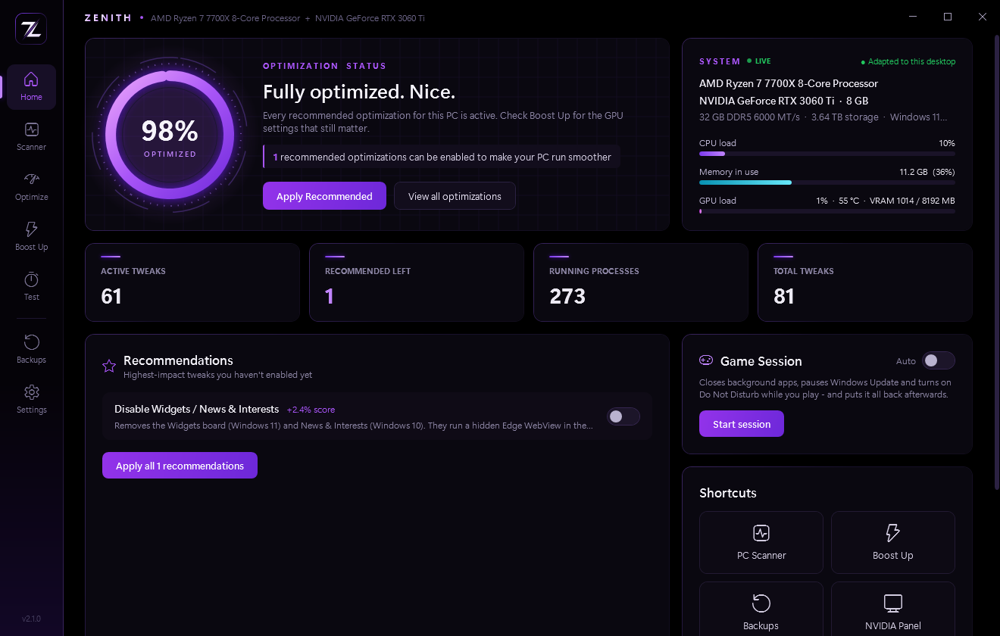
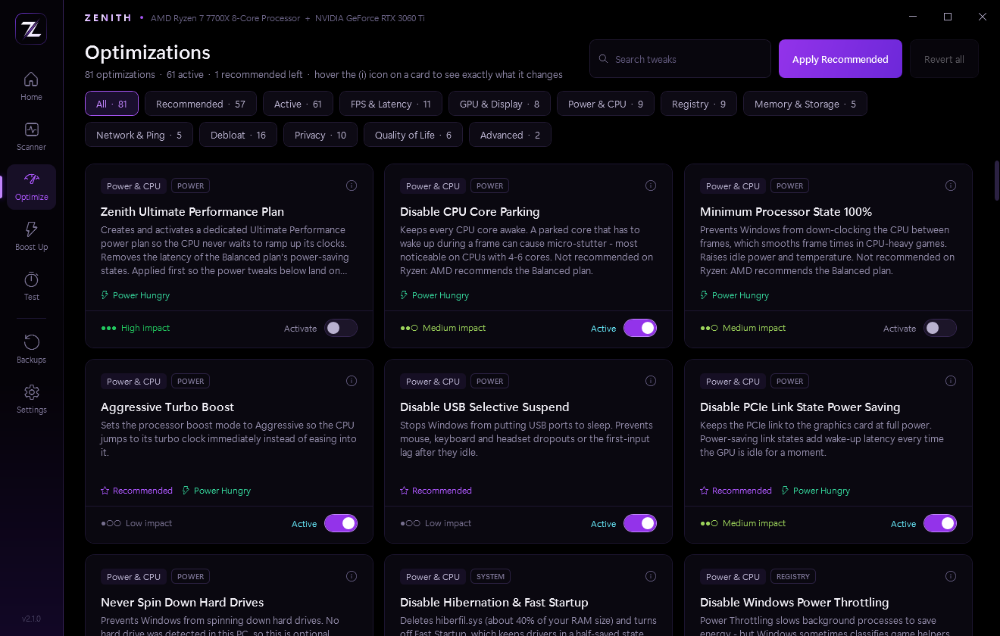
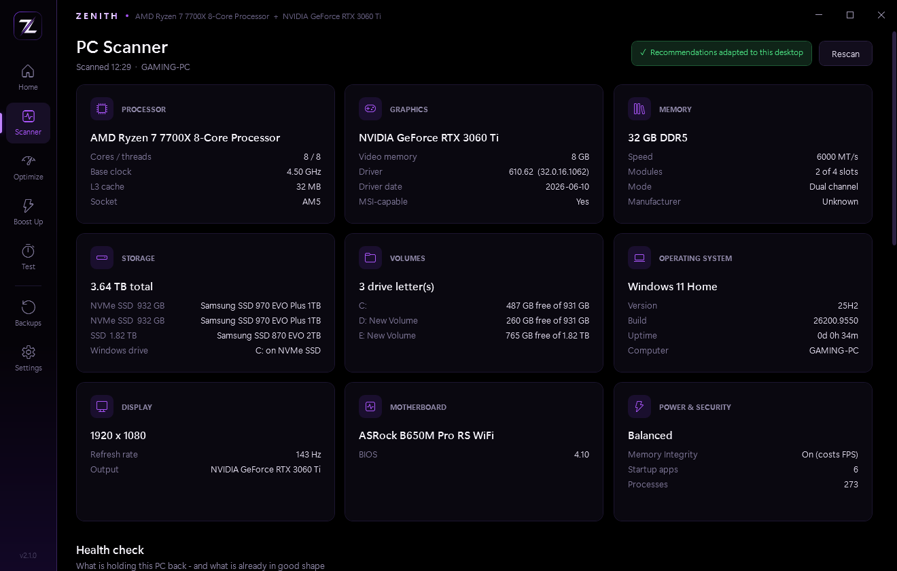
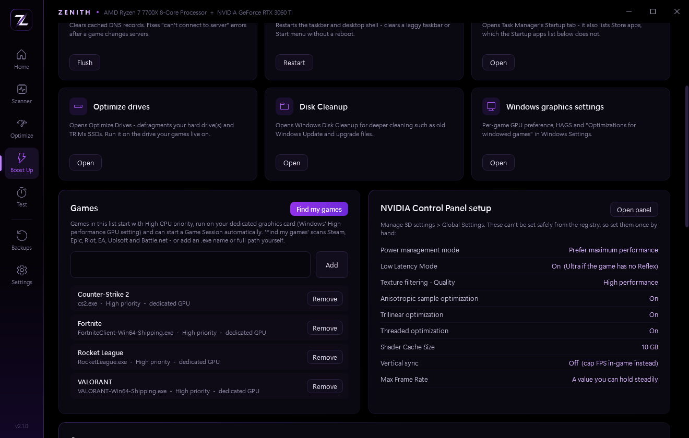
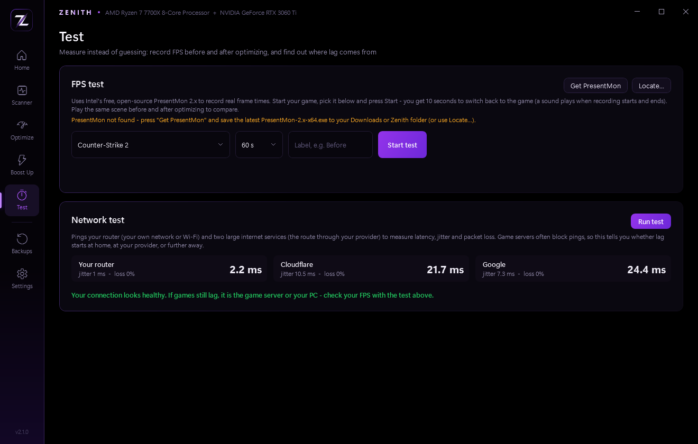
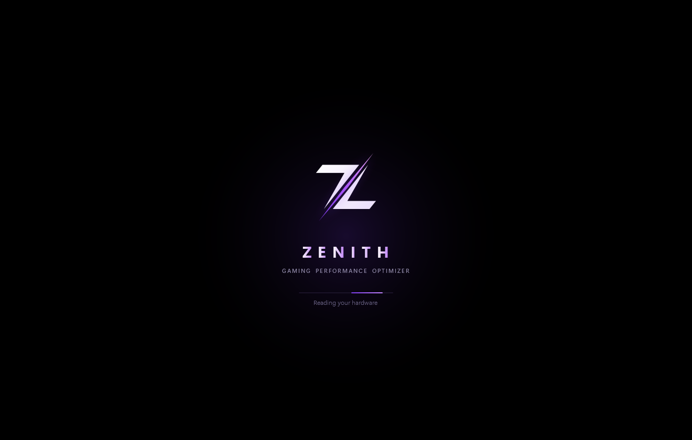

<div align="center">


# Zenith

**FPS & latency optimizer for Windows 10 and 11**

Scans your PC, recommends only what fits your hardware, and makes every change reversible.


[](LICENSE)



</div>

---

## Why Zenith

- **Adapts to the PC it runs on.** Desktop or laptop, Intel or AMD Ryzen, NVIDIA / AMD / Intel graphics, SSD or hard drive, how much RAM - the recommendations change to match. Copy the folder to another PC and it re-tunes itself.
- **Every change is reversible.** The original Windows value is saved before anything is changed, a System Restore point is made first, and one click puts it all back.
- **Never freezes.** Tweaks, cleanup and scans run on a background worker. Toggle as many as you like - they queue up and the window stays smooth.
- **Honest about what matters.** The Health check finds the fixes with real FPS impact (RAM running below its rated speed, a monitor plugged into the wrong port, Resizable BAR off), and tweaks with little measurable effect are labelled as such instead of padding a score.

## Features

| | |
|---|---|
| **81 optimizations** | FPS & latency, GPU & display, power & CPU, scheduler, memory & storage, network, debloat, privacy and quality-of-life tweaks. Hover any card to see exactly which registry keys, services, power settings or tasks it changes. |
| **Health check** | Flags XMP/EXPO off, a monitor below its max refresh rate, the main monitor plugged into the motherboard, Resizable BAR off (RTX 30+), single-channel RAM, an old GPU driver, a pending Windows restart, overlay/RGB apps fighting each other and background apps eating CPU. |
| **Game Session** | One click - or automatically when a game starts - closes background apps, pauses Windows Update and turns on Do Not Disturb. Ending it puts everything back. |
| **Tray while gaming** | When a game from your list starts, Zenith hides in the system tray: no window, no animations, no GPU use. |
| **Games** | *Find my games* scans Steam, Epic, Riot, EA, Ubisoft and Battle.net. Listed games get High CPU priority and the dedicated GPU; removing one restores the original settings exactly. |
| **Startup apps** | Switch apps on or off at startup, the same way Task Manager does. |
| **FPS test** | Average FPS plus 1% and 0.1% lows using Intel's open-source [PresentMon](https://github.com/GameTechDev/PresentMon), with a before/after comparison. |
| **Network test** | Latency, jitter and packet loss to your router and the internet, with a verdict on where lag starts. |
| **Boost Up** | Temp-file and shader-cache cleanup, a guided NVIDIA Control Panel / AMD Adrenalin setup, and in-game settings tuned to your GPU's VRAM and your monitor's refresh rate. |
| **PCPartPicker** | Lists every detected part (including the graphics card's board maker and the exact RAM kit) with a one-click PCPartPicker search for each. |
| **Profiles** | Export the optimizations active on one PC and import them on another. |

## Screenshots

| | |
|:---:|:---:|
|  |  |
| **Optimizations** - every tweak, with impact and what it changes | **PC Scanner** - hardware, health check and PCPartPicker |
|  |  |
| **Boost Up** - games, GPU control panel guide, startup apps | **Test** - FPS before/after and network diagnostics |

<div align="center">
<br>
<sub>Startup animation, shown while the hardware scan runs in the background</sub>
</div>

## Getting started

**Requirements:** Windows 10 (1809 or newer) or Windows 11 with Windows PowerShell 5.1, which is built into Windows. Nothing to install.

1. Download the repository (**Code > Download ZIP**) or clone it:
   ```
   git clone https://github.com/daltonlyon/Zenith.git
   ```
2. If you downloaded a ZIP: right-click it > **Properties** > tick **Unblock** > **OK**, then extract it somewhere permanent, e.g. `C:\Zenith`.
3. Double-click **`Launch Zenith.bat`** and accept the administrator prompt - changing system settings needs admin rights.

Optional: right-click `Launch Zenith.bat` > **Send to** > **Desktop (create shortcut)**.

### First run

1. **Scanner** - check that your hardware was detected and read the Health check; fix anything it flags first.
2. **Home > Apply Recommended** - a System Restore point is created before the first change.
3. **Restart** the PC.
4. **Boost Up** - set the GPU control panel options and in-game settings listed there.
5. **Test** - record an FPS run in your game before and after, so you can see the difference.

## Safety

- The original value of every setting is saved to `C:\ProgramData\Zenith\backup.json` before it is changed; switching a tweak off restores that exact value, and **Revert all** undoes everything.
- A System Restore point is created before the first change of each session.
- **Apply Recommended** never includes the Advanced security trade-offs (Memory Integrity, Spectre/Meltdown mitigations), and risky or feature-breaking tweaks ask for confirmation.
- Removed Store apps are the only change that can't be undone in-app - reinstall them from the Microsoft Store.
- If you close Zenith while optimizations are queued, the running step finishes so its backup is saved, and the rest are skipped.
- Everything is logged to `C:\ProgramData\Zenith\zenith.log`. Zenith makes no network requests of its own; the network test only pings your router and public DNS servers.

## How it adapts to each PC

- **Laptops:** power-hungry tweaks aren't recommended, and power tweaks only change the plugged-in setting, so battery behaviour stays the same.
- **AMD Ryzen:** the power-plan and core-parking tweaks aren't recommended, since AMD recommends the Balanced plan and Ryzen picks its fastest cores itself.
- **Graphics:** the control-panel guide matches the card (NVIDIA Control Panel or AMD Adrenalin), and NVIDIA-only tweaks only appear on NVIDIA.
- **Storage and RAM:** SysMain is only recommended with Windows on an SSD; memory-related tweaks consider the installed RAM.

Each PC keeps its own backup and log in its own `C:\ProgramData\Zenith`, so reverting on one PC never touches another.

## What to expect

No software makes a graphics card faster. Zenith removes Windows overhead, background activity and input latency, which shows up as smoother frame times, fewer stutters and better 1% lows. The biggest gains usually come from the fixes the Health check points out, from the in-game settings on the Boost Up page, and - on older CPUs - from the Advanced tweaks. Use the FPS test to measure your own results.

## All 81 optimizations

<details>
<summary>Show the full list</summary>

"Recommended" is the default for a typical desktop; Zenith adjusts it per PC (for example on laptops and Ryzen CPUs). Tags: **Reboot** / **Sign-out** - needs a restart or sign-out to take effect. **Power Hungry** - raises idle power use. **Feature Breaking** - turns off a Windows feature you may use. **Not Reversible** - removes apps (reinstall from the Store). **Security Risk** - lowers protection; never applied automatically.

**FPS & Latency**

| Tweak | Recommended | Notes |
|---|:---:|---|
| Enable Windows Game Mode | Yes |  |
| Disable Game DVR Background Recording | Yes |  |
| Disable Xbox Game Bar Overlay | Yes | Feature Breaking |
| Ensure HPET Is Not Forced | Yes | Reboot |
| Disable Dynamic Tick |  | Power Hungry, Reboot |
| Disable Fullscreen Optimizations (Global) |  |  |
| Disable Mouse Acceleration | Yes | Sign-out |
| Fastest Keyboard Repeat Response | Yes | Sign-out |
| Stop Background Apps | Yes | Feature Breaking |
| Stop Edge Startup Boost & Background Mode | Yes |  |
| No Forced Update Restarts While Signed In | Yes |  |

**GPU & Display**

| Tweak | Recommended | Notes |
|---|:---:|---|
| Hardware-Accelerated GPU Scheduling | Yes | Reboot |
| Disable Multiplane Overlay (MPO) | Yes | Reboot |
| Optimizations for Windowed Games | Yes | Win11 |
| Enable MSI Mode for NVIDIA GPU |  | Reboot |
| Disable Transparency Effects | Yes |  |
| Visual Effects: Best Performance | Yes | Sign-out |
| Disable NVIDIA Telemetry | Yes |  |
| Stop Windows Update Replacing Drivers | Yes |  |

**Power & CPU**

| Tweak | Recommended | Notes |
|---|:---:|---|
| Zenith Ultimate Performance Plan | Yes | Power Hungry |
| Disable CPU Core Parking | Yes | Power Hungry |
| Minimum Processor State 100% | Yes | Power Hungry |
| Aggressive Turbo Boost | Yes | Power Hungry |
| Disable USB Selective Suspend | Yes |  |
| Disable PCIe Link State Power Saving | Yes | Power Hungry |
| Never Spin Down Hard Drives | Yes | HDD |
| Disable Hibernation & Fast Startup | Yes | Reboot |
| Disable Windows Power Throttling | Yes | Power Hungry, Reboot |

**Registry**

| Tweak | Recommended | Notes |
|---|:---:|---|
| Prioritize Games in the Multimedia Scheduler | Yes |  |
| System Responsiveness for Gaming |  |  |
| Foreground Priority Boost (Win32PrioritySeparation) |  |  |
| Global Timer Resolution Requests | Yes | Reboot |
| Keep Kernel & Drivers in RAM | Yes | Reboot |
| Group Service Host Processes |  | Reboot |
| Instant Menus | Yes |  |
| Remove Startup App Delay | Yes |  |
| Faster Shutdown & Hung-App Detection | Yes |  |

**Memory & Storage**

| Tweak | Recommended | Notes |
|---|:---:|---|
| Disable Memory Compression |  | Reboot |
| Disable SysMain (Superfetch) |  | SSD |
| Disable Search Indexing |  | Feature Breaking |
| Disable NTFS Last-Access Timestamps | Yes |  |
| Disable 8.3 Short File Names | Yes |  |

**Network & Ping**

| Tweak | Recommended | Notes |
|---|:---:|---|
| Disable Nagle's Algorithm |  |  |
| Disable Network Throttling |  |  |
| Disable Network Adapter Power Saving | Yes |  |
| Stop Peer-to-Peer Update Uploads | Yes |  |
| Use Cloudflare DNS (1.1.1.1) |  |  |

**Debloat**

| Tweak | Recommended | Notes |
|---|:---:|---|
| Disable Copilot | Yes |  |
| Disable Widgets / News & Interests | Yes |  |
| Remove Bing Web Results from Start Search | Yes |  |
| Block Auto-Installed Sponsored Apps | Yes |  |
| Remove Start Menu Suggestions & Tips | Yes |  |
| Remove Windows Settings Ads | Yes |  |
| Remove Lock Screen Ads & Fun Facts | Yes |  |
| Disable Recall Snapshots | Yes | Win11 |
| Prevent OneDrive from Running |  | Feature Breaking |
| Remove News, Weather, Maps & Tips Apps | Yes | Not Reversible |
| Remove Office Hub, To Do, Clipchamp & Teams | Yes | Not Reversible |
| Remove Sponsored Games & Apps | Yes | Not Reversible |
| Remove Cortana, 3D Viewer & Mixed Reality | Yes | Not Reversible |
| Disable Unused Services | Yes |  |
| Disable Xbox Live Services |  | Feature Breaking |
| Disable Print Spooler |  | Feature Breaking |

**Privacy**

| Tweak | Recommended | Notes |
|---|:---:|---|
| Minimize Windows Telemetry | Yes |  |
| Disable Telemetry Services (DiagTrack) | Yes |  |
| Disable Telemetry Scheduled Tasks | Yes |  |
| Disable Advertising ID | Yes |  |
| Disable Tailored Experiences | Yes |  |
| Disable Activity History | Yes |  |
| Disable Windows Error Reporting | Yes |  |
| Disable Typing & Inking Data Collection | Yes |  |
| Disable Remote Assistance | Yes |  |
| Disable Location Services |  | Feature Breaking |

**Quality of Life**

| Tweak | Recommended | Notes |
|---|:---:|---|
| Disable Sticky / Filter / Toggle Keys Pop-ups | Yes |  |
| "End Task" in Taskbar Right-Click | Yes | Win11 |
| Classic Right-Click Menu |  | Win11 |
| Show File Extensions | Yes |  |
| Open File Explorer to This PC |  |  |
| Show Detailed Boot & Shutdown Status |  |  |

**Advanced**

| Tweak | Recommended | Notes |
|---|:---:|---|
| Disable Memory Integrity (VBS / HVCI) |  | Security Risk, Reboot |
| Disable Spectre & Meltdown Mitigations |  | Security Risk, Reboot |

</details>

## Project layout

| File | Purpose |
|---|---|
| `Zenith.ps1` | The whole app: tweak engine, background worker and WPF interface |
| `Launch Zenith.bat` | Asks for admin rights and starts Zenith without a console window |
| `Test-Zenith.ps1` | Smoke test - read-only, no admin needed, opens no window |
| `docs/` | Logo and screenshots for this page |

Run the tests with:

```
powershell -ExecutionPolicy Bypass -File .\Test-Zenith.ps1
```

## License

Zenith is released under the [MIT License](LICENSE) - free to use, modify and share. It changes system settings, so it comes without warranty: every change is reversible, but use it at your own risk.

<sub>Formerly FrameForge: on first launch Zenith copies FrameForge's backups from `C:\ProgramData\FrameForge`, so earlier tweaks can still be reverted.</sub>
